# Bulk Email Sender — User Guide

A self-hosted app for sending bulk, personalized email campaigns: upload a recipient
list, design an email, send it over SMTP or Amazon SES, and track opens, clicks and
bounces.

This guide describes only what was verified by running the application locally
(backend on `http://localhost:8000`, frontend on `http://localhost:5173`) and
driving it with a real browser. Anything not exercised this way is marked
**Unverified** rather than guessed at.

## Table of contents

1. [Signing in](#1-signing-in)
2. [Dashboard](#2-dashboard)
3. [Campaigns](#3-campaigns)
   - [3.1 Campaign list](#31-campaign-list)
   - [3.2 Creating a campaign — the wizard](#32-creating-a-campaign--the-wizard)
   - [3.3 Campaign detail](#33-campaign-detail)
4. [Templates](#4-templates)
   - [4.1 Classic editor](#41-classic-editor)
   - [4.2 The composer](#42-the-composer)
5. [Assets](#5-assets)
6. [Users](#6-users-admin)
7. [Settings](#7-settings-admin)
   - [7.1 General](#71-general)
   - [7.2 Sender identities](#72-sender-identities)
   - [7.3 Campaign controls](#73-campaign-controls)
   - [7.4 Email provider](#74-email-provider)
8. [Composer administration](#8-composer-administration-admin)
9. [Changing your password](#9-changing-your-password)
10. [Known gaps and unverified areas](#10-known-gaps-and-unverified-areas)

---

## 1. Signing in

Route: `/login`

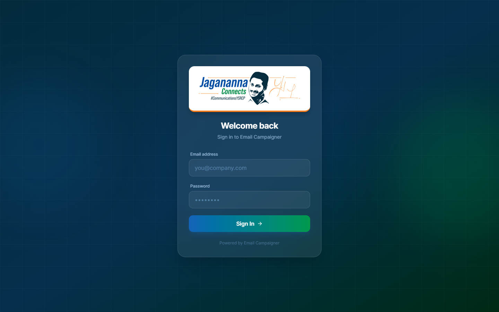

Sign in with an email and password. The default administrator account, created
automatically the first time the app starts with an empty database, is:

- Email: `admin@example.com`
- Password: `admin123`

That account is flagged to require a password change on first use — see
[Changing your password](#9-changing-your-password).

The page's branding (logo, colours, app name) comes from **Settings → General** and
loads even before you sign in, since it's needed to render this page.

## 2. Dashboard

Route: `/` (protected — the app redirects here after sign-in)

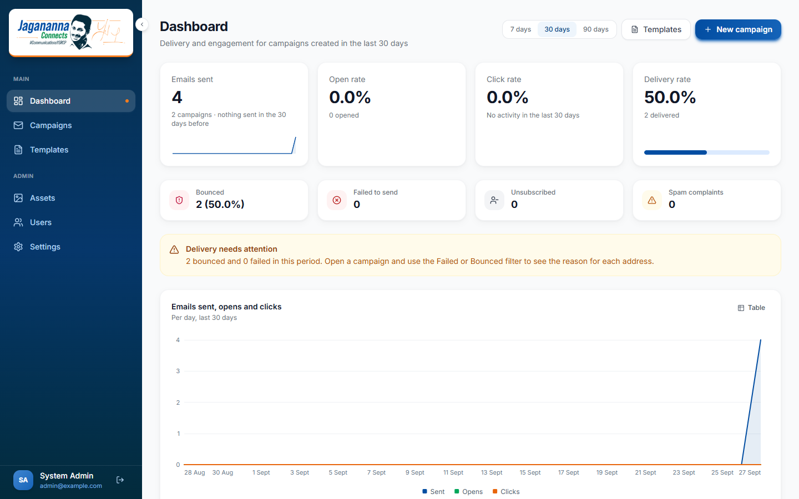

The landing page after sign-in. It shows, for a selected time range (7/30/90 days):

- Four headline stat tiles — **Emails sent**, **Open rate**, **Click rate**,
  **Delivery rate** — each with the change versus the previous period and a small
  trend sparkline.
- Secondary tiles for **Bounced**, **Failed to send**, **Unsubscribed** and **Spam
  complaints**.
- A **Delivery needs attention** banner when bounce/failure volume is high.
- An **In progress** panel listing any campaign currently sending or scheduled, with
  a live progress bar.
- A line chart of sent/opens/clicks per day.
- A funnel chart from sent → delivered → opened → clicked.
- A bar chart of campaigns by status.
- A bar comparison of open/click rate across your most recent sent campaigns —
  selecting a bar opens that campaign.
- A "Recent campaigns" list linking into each one.

Every chart has a **Table** toggle in its header that swaps the chart for the
same numbers as a plain table.

## 3. Campaigns

### 3.1 Campaign list

Route: `/campaigns`

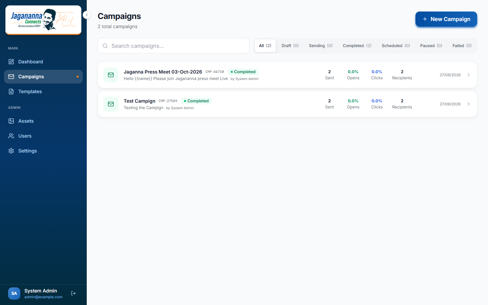

Lists every campaign with its status, sent/open/click counts, and recipient count.
You can search by name/subject and filter by status. Each row has a shortcut to
clone the campaign, and draft campaigns show an inline edit shortcut.

### 3.2 Creating a campaign — the wizard

Route: `/campaigns/new` (and `/campaigns/:id/edit` to resume an existing draft)

The wizard has five steps, shown as a progress bar at the top: **Details →
Recipients → Map Columns → Compose → Review & Send**.

**Step 1 — Details.** Name, subject line (supports `{{merge_field}}` placeholders),
an optional preheader, and the sender identity (from Settings → Sender identities).

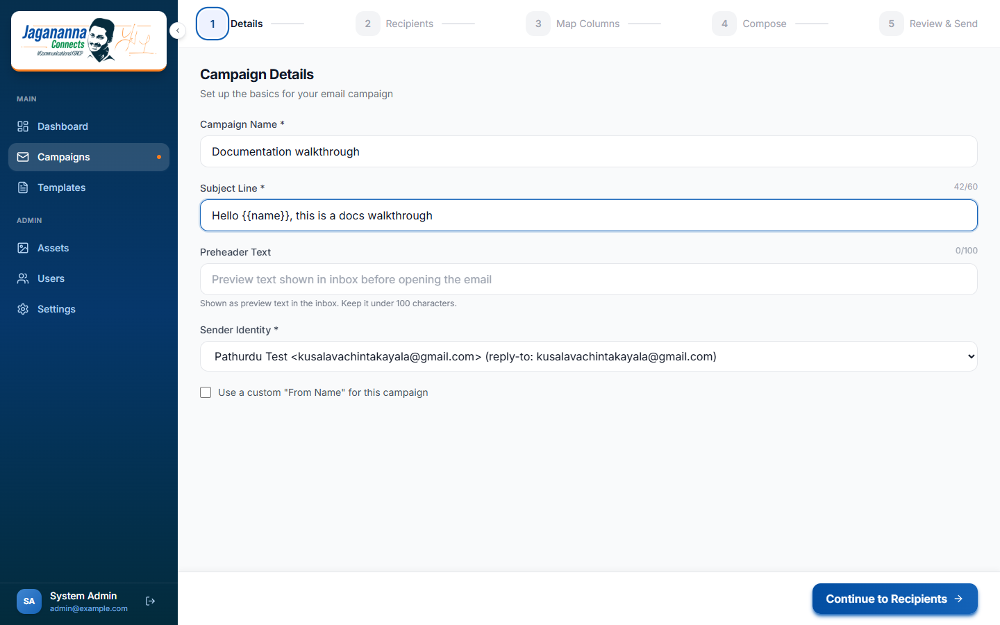

Continuing here creates the campaign server-side immediately and moves the browser
to `/campaigns/<code>/edit`, so the campaign is never only "remembered" by
unsaved page state — refreshing, or leaving for the composer and coming back,
does not lose your place.

**Step 2 — Recipients.** Two ways to add recipients:

- **Upload File** — a CSV or Excel file (drag-and-drop or browse).
- **Import from Campaign** — copy the recipient list from another campaign,
  automatically skipping duplicates and any address on the suppression list
  (for example an address that bounced on a previous send).

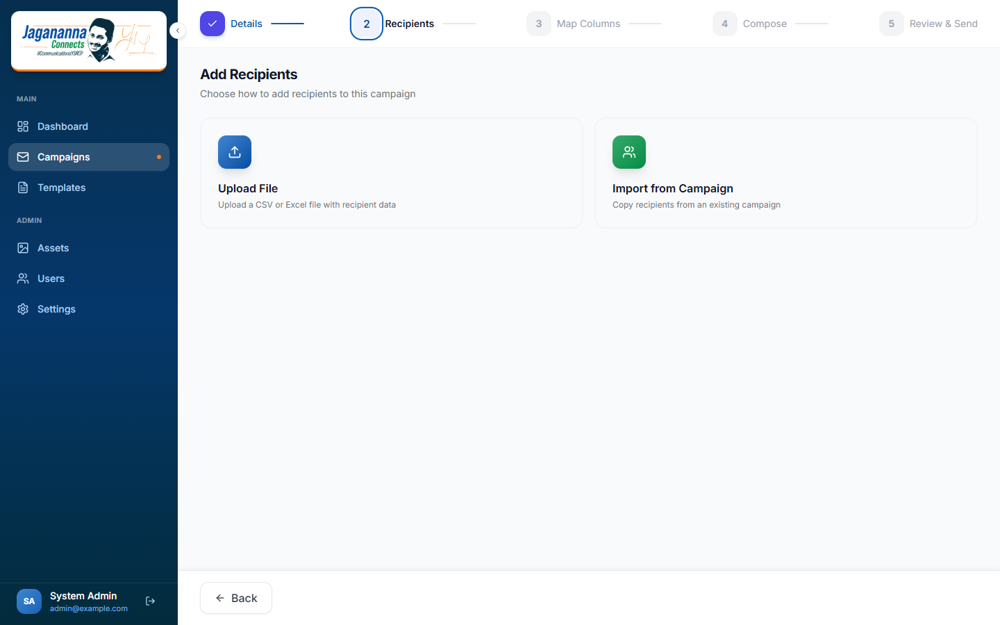

Verified live: importing from a campaign that had one bounced recipient correctly
skipped that address and reported it as suppressed, rather than copying it —
see [Section 7.4](#74-email-provider) for where bounces come from.

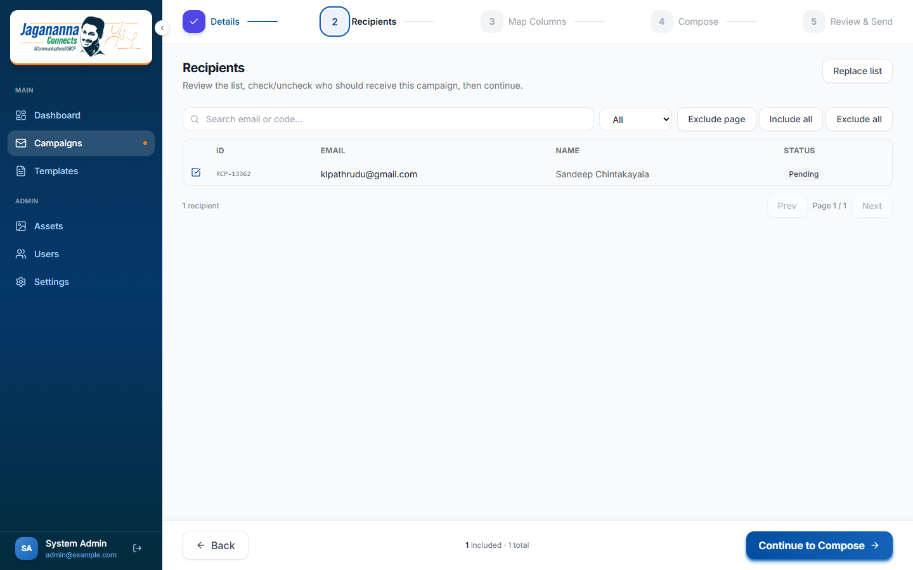

Once recipients exist, this step shows a searchable, paginated table where you can
include/exclude individual recipients, a page of them, or all of them.

**Step 3 — Map Columns.** (Upload path only — the campaign already knows its
columns after an import.) Choose which uploaded column is the email address and
optionally the name, and define any merge fields to pull from other columns.

**Upload screen, unverified beyond this screenshot:** the drag-and-drop file input
opens the operating system's native file picker, which browser automation can't
drive reliably; actually selecting and processing a file was verified separately
through the API in earlier testing, not through this exact screen in this session.

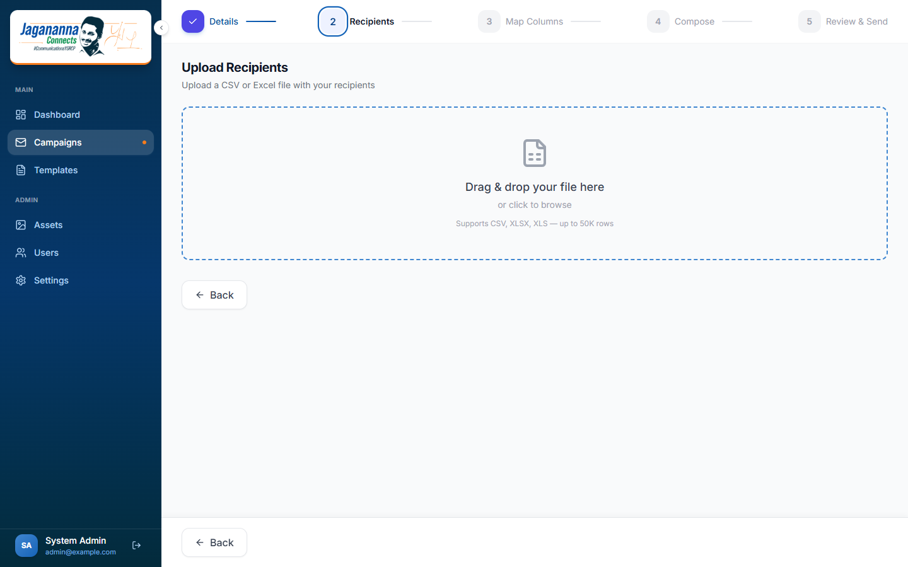

**Step 4 — Compose.** All email design happens in a separate tool, the
**composer** (described in [Section 4.2](#42-the-composer)) — this step is a
launcher and status screen, not an editor itself.

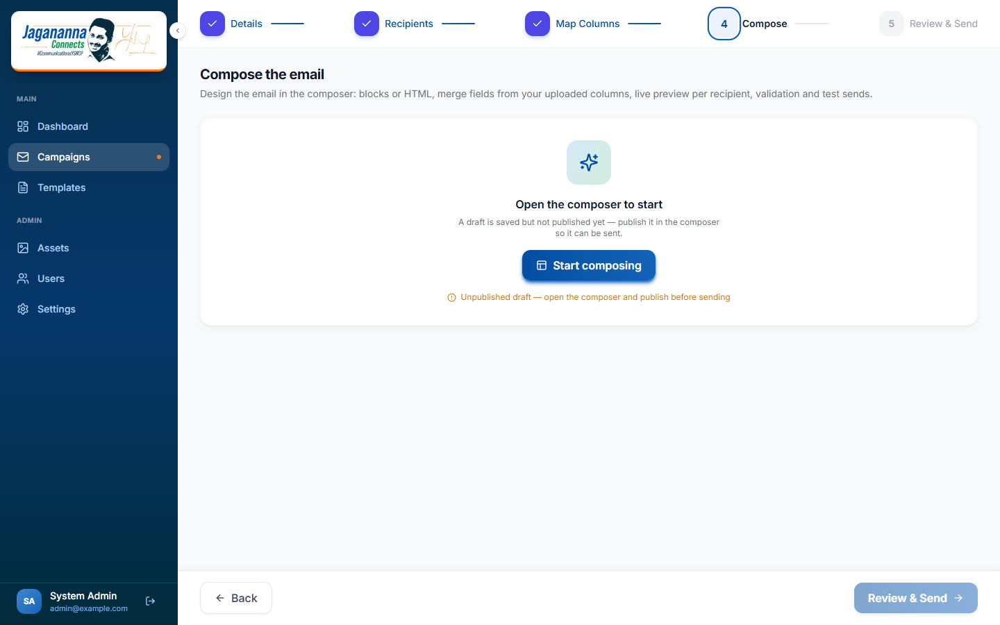

- **"Start composing" / "Open composer"** opens the composer for this campaign's
  content.
- The step shows whether content is a **Draft** or **Published**, and blocks
  "Review & Send" until something has been published. A campaign can only be sent
  once its content has been published in the composer — an unpublished draft is
  not enough.
- Leaving the composer (its own back arrow, "Close the composer") always returns
  here reliably, regardless of how the composer was opened — verified by opening
  it via a direct URL (simulating a page refresh) and confirming the back button
  still works, not just when reached by clicking through from this page.

**Step 5 — Review & Send.** Shows a summary (name, subject, from address, recipient
count) and the rendered email preview, and lets you either send immediately or pick
a future date/time to schedule it. **Not captured with real content in this
session** — see [Known gaps](#10-known-gaps-and-unverified-areas).

### 3.3 Campaign detail

Route: `/campaigns/:id`

Four tabs, verified on a real completed campaign (2 recipients, 1 sent, 1 bounced):

**Overview** — stat tiles (Sent, Open Rate, Click Rate, Bounce Rate), a funnel
chart from recipients to clicks, a donut chart of recipients by status, and
campaign details (from address, reply-to, delivery rate, created/scheduled times).

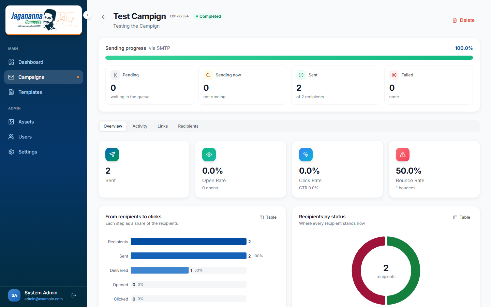

**Activity** — a line chart of opens and clicks over time.

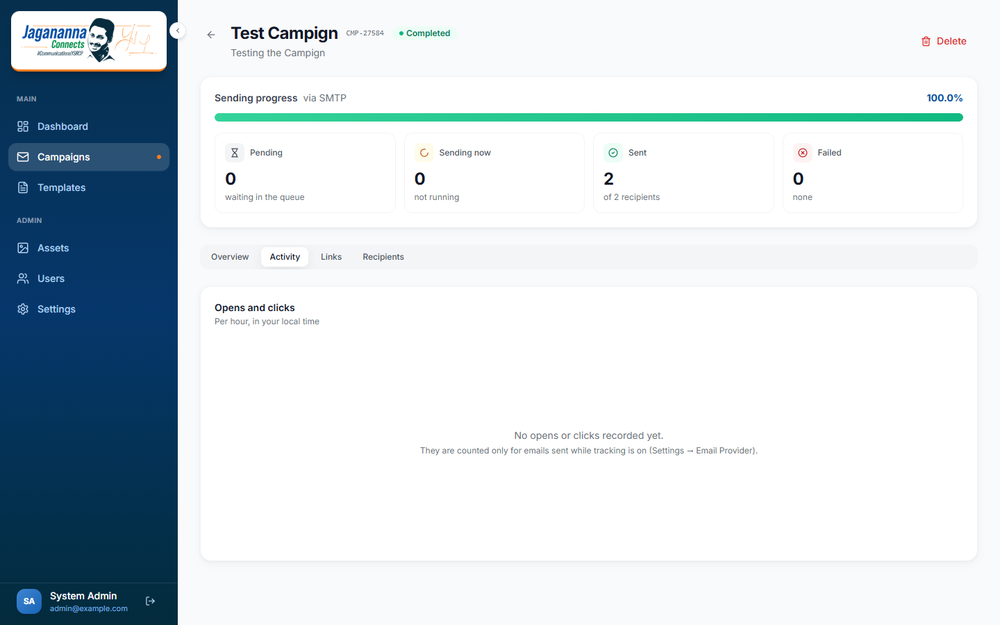

**Links** — click counts per link found in the email. Verified as reachable and
correctly rendering the empty state ("No link clicks recorded yet") for this
campaign, since its one delivered email had no clicks.

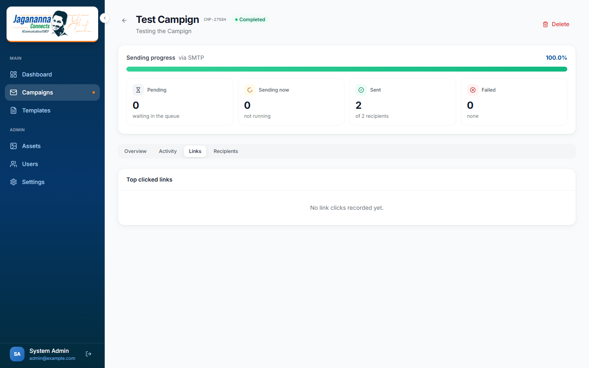

**Recipients** — a filterable, paginated table of every recipient with their
status; a **Failed**/**Bounced** filter shows the specific error for each address.

For a campaign that is currently sending, this page also shows a live queue panel
(Pending / Sending now / Sent / Failed tiles with an ETA) and Pause/Resume/Retry
failed actions. **Unverified in this session** — no campaign was mid-send at the
time of the walkthrough; this behavior was exercised in earlier development
testing, not in this documentation pass.

## 4. Templates

Route: `/templates`

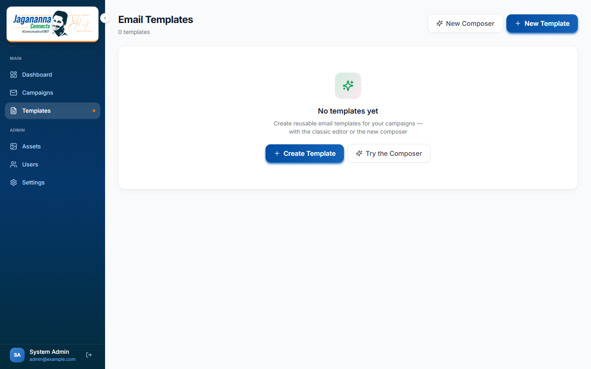

Reusable email designs you can start a campaign from. Two separate editors are
available side by side, verified working independently:

### 4.1 Classic editor

The **New Template** button opens an inline editor on this same page: name,
description, a merge-field list, and a rich-text/HTML editor with a live preview
pane.

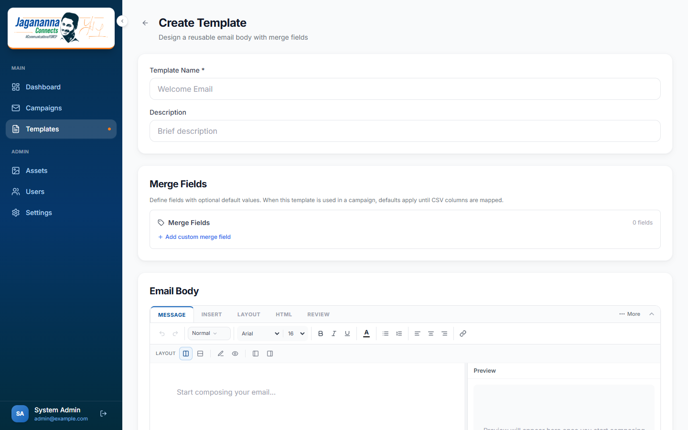

### 4.2 The composer

The **New Composer** button (or a template card's composer icon) opens the newer,
full-viewport design tool at `/composer/template/:code`. Starting a new one first
asks how to begin:

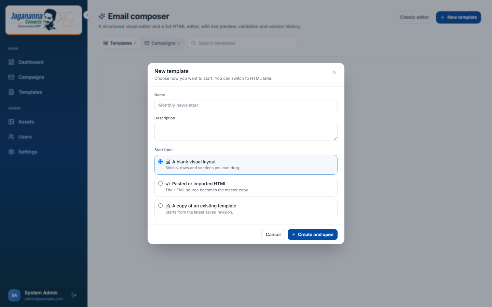

The composer workspace itself has a block palette on the left (drag blocks and
layouts onto the canvas), the canvas in the middle, a properties panel on the
right (subject, preheader, theme, page width, background), and a live preview
on the far right.

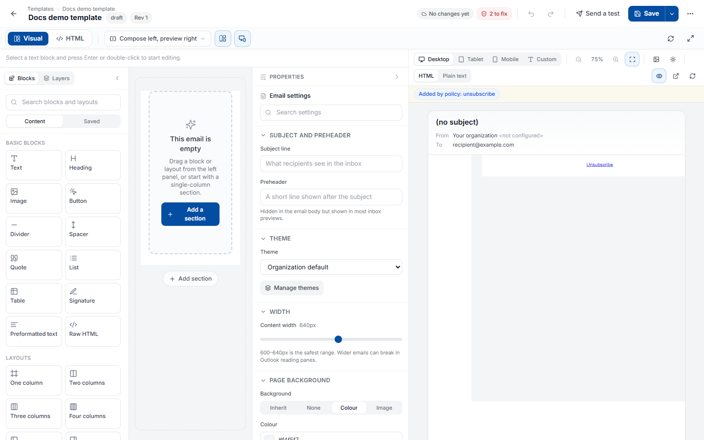

It also has a **Visual / HTML** switch for editing the raw HTML source directly,
with its own validation and a "Problems"/"Warnings" panel (switching a
visual document to HTML is a one-way, explicitly confirmed action, since the
block editor can no longer represent hand-written HTML afterward).

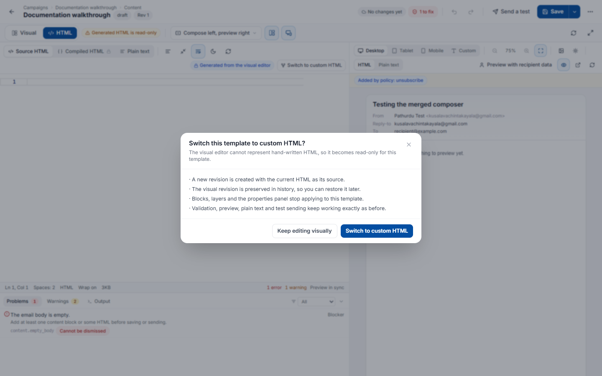

The composer also has, per its toolbar (not individually screenshotted this
session): undo/redo, **Send a test**, a manual Save with save-options, a revision
history browser, and a Publish step — a template or campaign must be published
before it can be sent.

## 5. Assets

Route: `/assets` (admin)

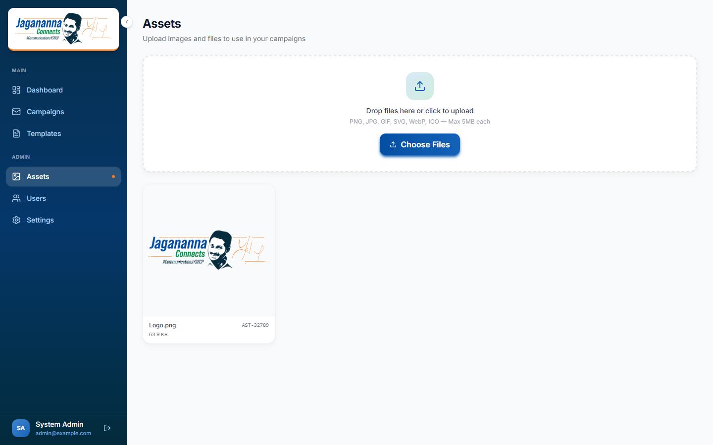

Upload and manage images used inside emails (drag-and-drop or browse; PNG, JPG,
GIF, SVG, WebP, ICO up to 5MB each). Each asset can be copied as a URL or deleted.

## 6. Users (admin)

Route: `/users`

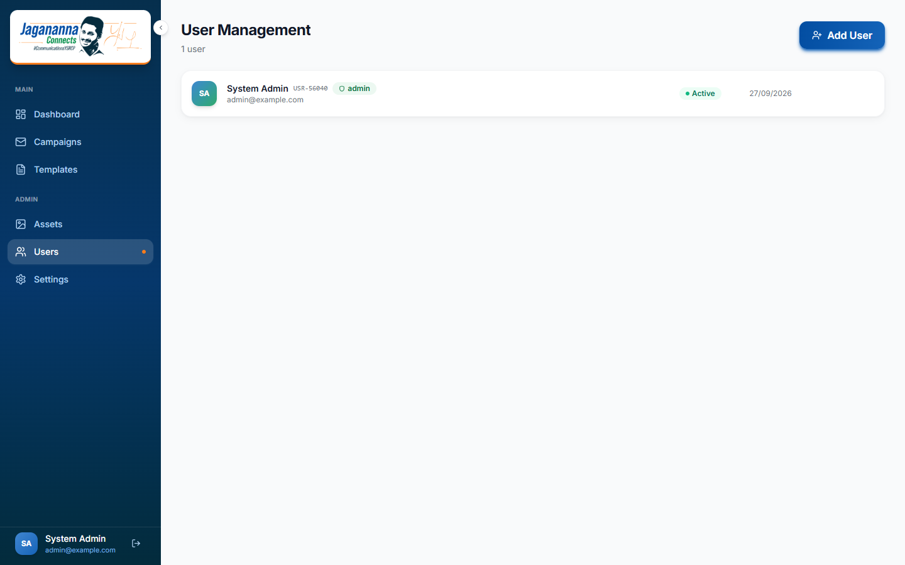

Lists every user account with role and active/inactive status. Admins can create
new users (email, name, password, role) and deactivate or delete existing ones.

## 7. Settings (admin)

Route: `/settings`, four tabs.

### 7.1 General

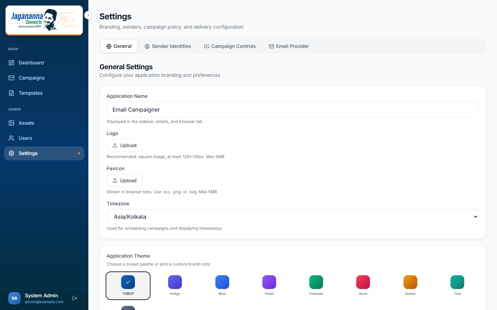

Application name, logo/favicon upload, timezone, and the colour palette used
throughout the app (including a custom-colour option).

### 7.2 Sender identities

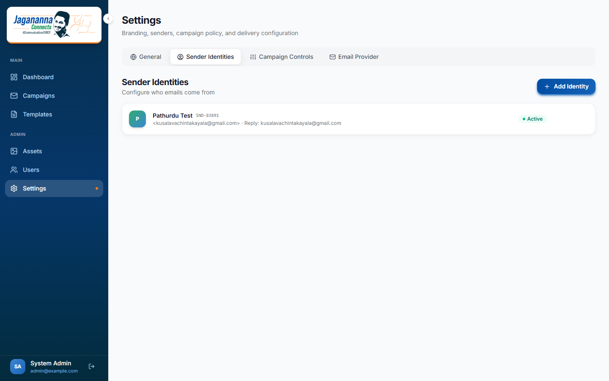

The "from" addresses campaigns can send as: from name, from email, optional
reply-to, and which one is the default. These are what populate the sender
dropdown in the campaign wizard's Details step.

### 7.3 Campaign controls

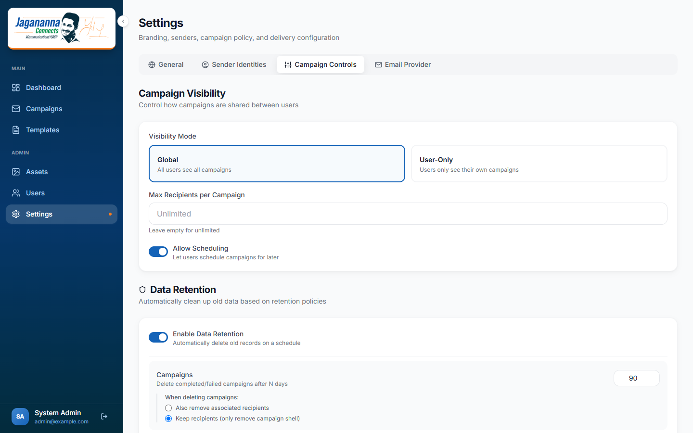

Admin-level policy: whether campaigns are visible to their creator only or
globally to every user, an optional per-campaign recipient cap, and whether
scheduling a send for later is allowed at all.

### 7.4 Email provider

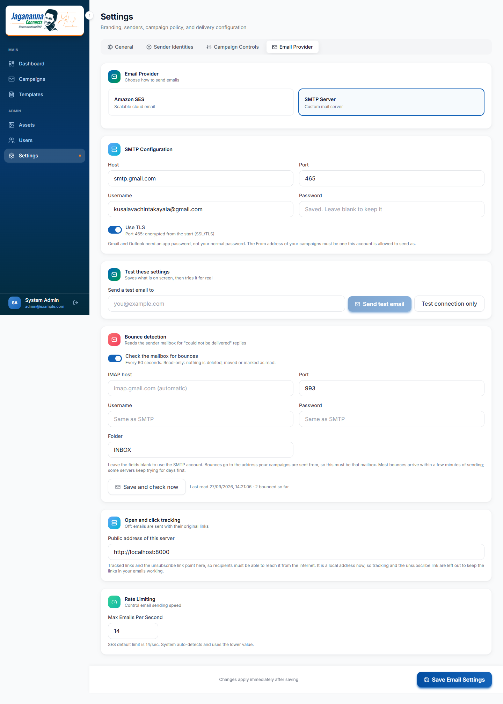

The sending backend and everything downstream of it:

- **Provider** — Amazon SES or SMTP, with SES's sandbox-mode toggle shown only
  for SES.
- **SMTP configuration** — host, port, username, password, TLS. A password
  already saved is shown as "Saved. Leave blank to keep it" rather than being
  sent back to the browser.
- **Rate limiting** — a maximum emails-per-second cap.
- **Bounce detection** (SMTP only) — reads the sending mailbox over IMAP for
  "undeliverable" replies and marks the matching recipient as bounced. Verified
  live: after sending a test campaign to one valid and one nonexistent address,
  running "Save and check now" here correctly found the bounce message and
  updated the recipient's status to Bounced with the mail server's own error text,
  and added that address to the suppression list. A "Save and check now" button
  also doubles as a connection test.
- **Open and click tracking** — the public address recipients' mail clients will
  reach for the tracking pixel, tracked links and the unsubscribe link. Left as a
  local address, tracking is automatically switched off (there would be nothing
  for a real recipient's mail client to reach), which was confirmed via the
  provider's own status text on this page.
- A **Send test email** action that saves the current settings and sends a real
  test message through them.

## 8. Composer administration (admin)

Route: `/settings/composer`

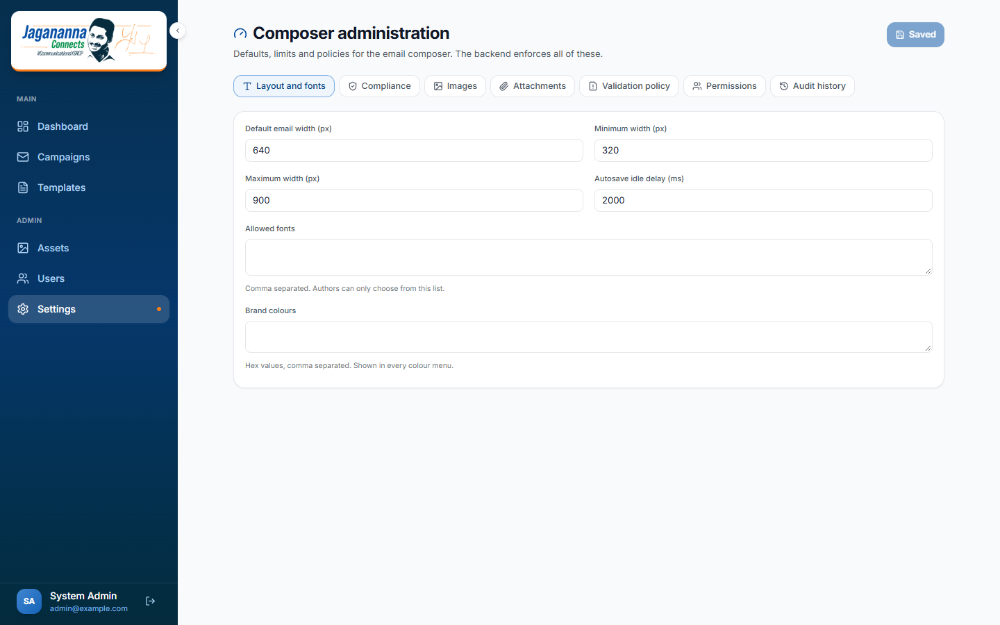

Organization-wide defaults and limits enforced by the backend for every use of
the composer, across seven tabs: **Layout and fonts** (default/min/max email
width, autosave delay, allowed fonts, brand colours — shown here), **Compliance**,
**Images**, **Attachments**, **Validation policy**, **Permissions**, and
**Audit history**.

## 9. Changing your password

Route: `/change-password`

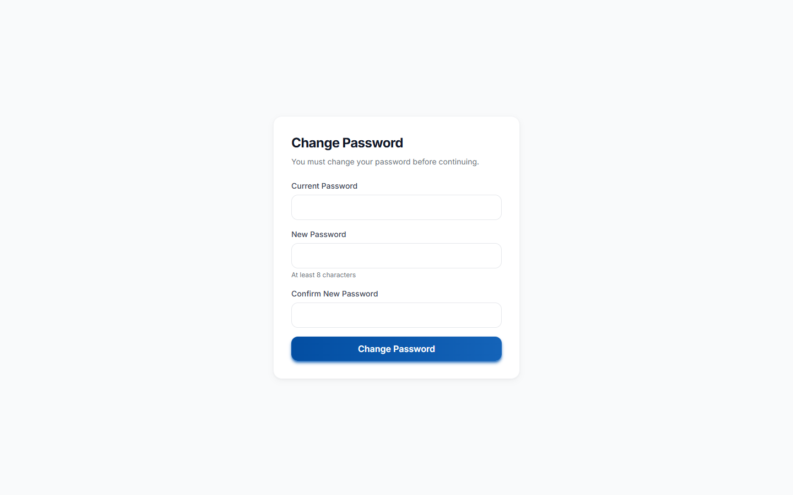

Reachable any time, and shown automatically after signing in with an account
still flagged to change its password (true of the default admin account until
it's changed once) — current password, new password (minimum 8 characters), and
a confirmation field.

## 10. Known gaps and unverified areas

Documented here rather than guessed at, per the instruction to describe only
verified behavior:

- **Review & Send with real content.** The wizard's final step was reached and
  screenshotted only in its pre-content state (Compose step, nothing published
  yet); the fully-populated Review & Send screen with a real preview and the
  Send/Schedule action was not captured in this pass.
- **A campaign actively sending.** The live "Pending / Sending / Sent / Failed"
  queue panel and its Pause/Resume/Retry controls, described in
  [Section 3.3](#33-campaign-detail), were not observed live in this session —
  no campaign was mid-send at the time.
- **CSV/Excel upload through the browser's native file picker.** The screen was
  reached and screenshotted, but the OS file-picker dialog it opens is outside
  what browser automation can drive; the upload endpoint itself was verified
  separately (not as part of this documentation pass).
- **Amazon SES sending.** This installation is configured for SMTP; SES's own
  send path, and its sandbox-mode restriction, were not exercised.
- **User management actions** (creating, deactivating, deleting a user) were
  viewed on the Users list but not exercised, to avoid changing real accounts on
  this installation.
